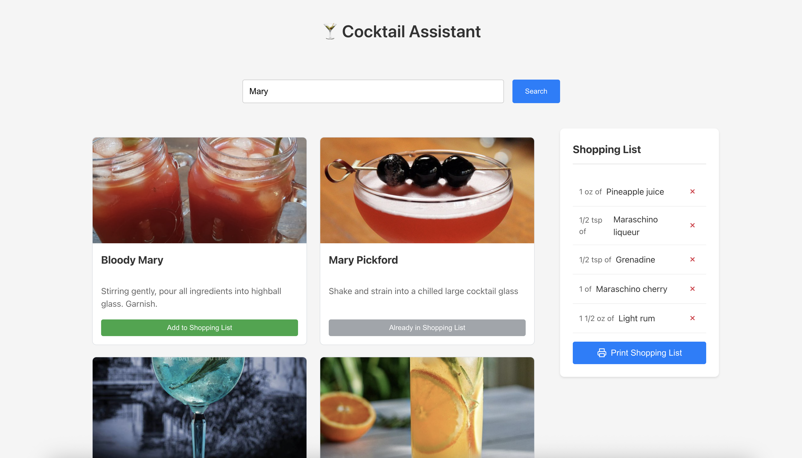

## AI Assistant

``` markdown
# Cocktail Assistant

A modern web application built with Pion and lit-html that helps users discover cocktail recipes and create shopping lists for ingredients.



## Features

- 🔍 **Search Cocktails**: Search through an extensive database of cocktails
- 📱 **Responsive Design**: Works seamlessly on both desktop and mobile devices
- 🛒 **Shopping List Management**: 
  - Add ingredients from cocktails to a shopping list
  - Remove items from the shopping list
  - Print shopping list for offline use
  - Prevent duplicate ingredients when adding from multiple cocktails
- 🔔 **Toast Notifications**: Instant feedback for all user actions

## Prerequisites

- Node.js (v14 or higher)
- npm (v6 or higher)

## Installation

1. Clone the repository:
```
bash git clone [https://github.com/yourusername/cocktail-assistant.git](https://github.com/yourusername/cocktail-assistant.git) cd cocktail-assistant
``` 

2. Install dependencies:
```
bash npm install
``` 

## Development

Start the development server:
```
bash npm start
``` 

The application will be available at `http://localhost:8000`

## Project Structure
```
cocktail-assistant/
├── index.html                    # Main HTML entry point
├── index.js                      # JavaScript entry point
├── package.json                  # Project dependencies and scripts
├── README.md                     # Project documentation
└── src/
├── App.js                    # Main application component
├── style.css                 # Global styles
├── services/
│   └── cocktailApiService.js # API integration
├── utils/
│   └── printUtils.js         # Print functionality
└── components/
├── CocktailList/
│   ├── CocktailList.js   # Grid of cocktail cards
│   └── CocktailCard.js   # Individual cocktail display
├── Search/
│   └── SearchBar.js      # Search input component
├── ShoppingList/
│   └── ShoppingList.js   # Shopping cart component
└── Toaster/
└── Toaster.js        # Notification system
``` 

## Technologies Used

- [@pionjs/pion](https://github.com/pionjs/pion) - Web Components framework
- [lit-html](https://lit.dev/docs/libraries/standalone-templates/) - HTML templating library
- [@web/dev-server](https://modern-web.dev/docs/dev-server/overview/) - Development server
- [TheCocktailDB API](https://www.thecocktaildb.com/api.php) - Cocktail database

## API Usage

The application uses the free tier of TheCocktailDB API, which allows searching cocktails by name. No API key is required for basic search functionality.

## Browser Support

The application supports all modern browsers that implement the Web Components standard:

- Chrome/Chromium (latest)
- Firefox (latest)
- Safari (latest)
- Edge (latest)

## Contributing

1. Fork the repository
2. Create your feature branch: `git checkout -b feature/my-new-feature`
3. Commit your changes: `git commit -am 'Add some feature'`
4. Push to the branch: `git push origin feature/my-new-feature`
5. Submit a pull request

## License

This project is licensed under the MIT License - see the [LICENSE](LICENSE) file for details.

## Acknowledgments

- Thanks to [TheCocktailDB](https://www.thecocktaildb.com/) for providing the cocktail database
- Icons provided by [Feather Icons](https://feathericons.com/)
```
